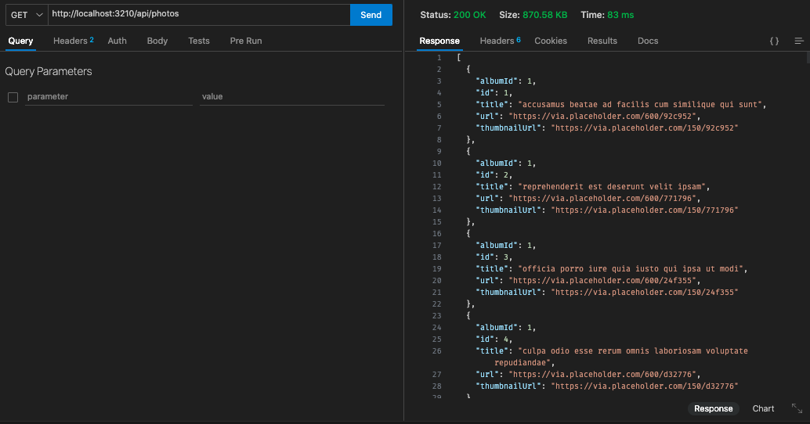

# Simple Demo project with redis

- This project created in order to test redis implementation on expressjs application
- This is the result

  

  

- On the code provided for the first time endpoint got hit, it will store all of the data into redis with expiration 10 second
- First test shows that api need `618ms` to response
- Second test which mean the data is already stored on redis only need `83ms` to respond
- 10 seconds passed the data will be removed automatically
